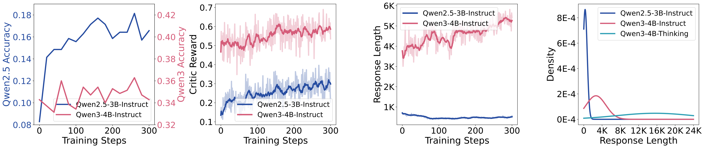

# MicroCoder-Insights: Training Recipes for Modern Coding Models

<p align="center">
  <b>Content</b>
</p>

<p align="center">
  <a href="#news">🚀News</a> •
  <a href="#related_papers">📖Related_Papers</a> •
  <a href="#motivation">✨Motivation</a>
</p>

<p align="center">
  <a href="#code_evaluator">🖥️Code_Evaluator_Robustness</a> •
  <a href="#temperature">☀️ Temperature_Dynamics</a> •
  <a href="#data">📊 Data_Quality</a> •
  <a href="#context_length_and_extension">📄 Context_Length_and_Extension</a>
</p>

<p align="center">
  <a href="#truncation_mask">📏 Truncation_Mask</a> •
  <a href="#batch_size">🏘️ Batch_Size_and_On-Policy</a> •
  <a href="#kl_loss_and_clip_ratio">🖇️ KL_Loss_and_Clip_Ratio</a> •
</p>

<p align="center">
  <a href="#citation">📌Citation</a> •
  <a href="#license">🔖License</a>
</p>

<p align="center">
  <b>Links</b>
</p>

<div id="news">&nbsp;</div>


## 🚀 News

- **[2025.10.02]** The blog was created.

<div>&nbsp;</div>
<div>&nbsp;</div>
<div id="related_papers">&nbsp;</div>


## 📖 Related Papers

- **Breaking Training Bottlenecks: Effective Reinforcement Learning for Modern Coding Models**  
  Zongqian Li <sup>1, 2</sup>, Shaohan Huang <sup>1</sup>, Zewen Chi <sup>1</sup>, Yixuan Su <sup>2</sup>, Lexin Zhou <sup>3</sup>, Li Dong <sup>1</sup>, Nigel Collier <sup>2</sup>, Furu Wei <sup>1</sup>    
  Microsoft <sup>1</sup>, University of Cambridge <sup>2</sup>, Princeton University <sup>3</sup>    
  [Algorithm_Paper]()
- **MicroCoder-Dataset: A Latest and Challenging Dataset for Training Modern Coding Models**  
  Zongqian Li <sup>1, 2</sup>, Shaohan Huang <sup>1</sup>, Tengchao Lv <sup>1</sup>, Lei Cui <sup>1</sup>, Nigel Collier <sup>2</sup>, Furu Wei <sup>1</sup>    
  Microsoft <sup>1</sup>, University of Cambridge <sup>2</sup>  
  [Dataset_Paper]()
- **MicroCoder-Insights: Training Recipes for Modern Coding Models**  
  123  
  [Insight_Blog]()

<div>&nbsp;</div>
<div>&nbsp;</div>
<div id="motivation">&nbsp;</div>


## ✨ Motivation

- **Cross-generational training effectiveness**: Current training methods demonstrate substantial improvements on Qwen 2.5 models but minimal improvements on Qwen 3 models, revealing generation-specific training bottlenecks
- **Dataset difficulty gap**: Mainstream datasets pose greater difficulty for Qwen 2.5 while appearing relatively simple for Qwen 3 capabilities, indicating need for more challenging training corpora
- **Fundamental behavioral differences**: Output behavior patterns differ fundamentally between generations; Qwen 3 models exhibit pronounced upward trends in response length during training whereas Qwen 2.5 models show stable or decreasing lengths; across model series progression from Qwen 2.5-Instruct to Qwen 3-Instruct to Qwen 3-Thinking, standard outputs demonstrate increasing length and variance

<p align="left">
  
</p>

<div>&nbsp;</div>
<div>&nbsp;</div>
<div id="code_evaluator">&nbsp;</div>


## 🖥️ Code Evaluator Robustness

- **MicroCoder-Evaluator capabilities**: Multi-strategy comparison with 6-7 fallback methods, format flexibility handling lists/tuples/strings/sets with automatic type conversions, approximate numerics using np.allclose() for floating point tolerance plus rounding, extensive preprocessing including multi-line splitting and whitespace normalization, high fault tolerance continuing different comparison approaches when individual methods fail
- **LiveCodeBench Evaluator capabilitie**s: Exact matching through direct equality comparison (prediction == gt_out), precise numerics via Decimal library for high-precision floating point operations, minimal preprocessing limited to basic whitespace stripping
- **Gold standard principle**: Higher accuracy values generally represent more reliable evaluation, as comprehensive comparison methods better capture valid solution variations when matching outputs against ground truth answers
- **Comprehensive validation benefits**: MicroCoder-Evaluator achieves higher critic reward scores, indicating more accurate assessment of solution quality
- **Training effectiveness**: MicroCoder-Evaluator enables superior model training with fewer misjudgments, reduced noise injection, faster test accuracy improvement, and higher convergence values
- **Temporal dynamics**: Performance differential between evaluators is particularly pronounced during early training stages, where robust evaluation becomes critical for establishing proper learning feedback

<p align="left">
  
</p>

<div>&nbsp;</div>
<div>&nbsp;</div>
<div id="temperature">&nbsp;</div>


## ☀️ Temperature Dynamics

- **Temperature robustness**: Models develop increasing temperature robustness throughout training, with the upper bound of stable temperatures progressively expanding
- **Temperature-diversity relationship**: Higher temperatures naturally increase output diversity
- **Diversity decrease**: Output diversity systematically decreases at fixed temperatures as training progresses
- **Critical diversity threshold**: When initial output diversity falls below expected convergence values, models experience continued diversity reduction accompanied by training failure
- **Traditional temperature limitations**: Conventionally standard temperatures (t=0.6) can cause training failure in modern models
- **Modern model capability**: Contemporary models like Qwen-3 demonstrate stable training even at elevated temperatures (t=1.8) with minimal influence on final convergence values
- **Convergence consistency**: Output diversity converges to similar final values across different temperature settings despite varying temperatures
- **Diversity-determined selection**: Training temperature should be determined based on response diversity, selecting values that avoid both excessively low temperatures causing continuous diversity decline and excessively high temperatures leading to drastic fluctuations, with optimal temperatures enabling stable diversity convergence
- **Dynamic scheduling advantag**e: Low-to-high temperature scheduling yields superior performance by reducing initial diversity during high-temperature stages, ultimately achieving better results than direct high-temperature training from initialization
- **Continuous change risks**: Continuous uniform temperature changes significantly influence training stability, with even brief sequential temperature increases or decreases within small step windows causing irreversible diversity shifts, necessitating staged temperature transitions or diversity-determined constant initial temperatures

<p align="left">
  
</p>

<div>&nbsp;</div>
<div>&nbsp;</div>
<div id="data">&nbsp;</div>


## 📊 Data Quality

- **Superior improvement effectiveness**: MicroCoder dataset drives rapid and pronounced accuracy gains, while DeepCoder dataset training shows minimal performance variation
- **Dataset difficulty**: MicroCoder dataset consistently generates lower critic rewards, indicating higher problem complexity
- **Challenging problem effectiveness**: Despite both datasets exhibiting similar critic reward growth trends during training, only MicroCoder dataset produces significant test set improvements, demonstrating that training effectiveness on challenging problems translates more directly to generalization performance
- **Response length dynamics**: Harder problems exhibit accelerated response length growth with greater final magnitudes; MicroCoder dataset demonstrates faster growth rates and ultimately achieves longer outputs despite initially producing similar or shorter response lengths compared to DeepCoder dataset

<p align="left">
  
</p>

<div>&nbsp;</div>
<div>&nbsp;</div>
<div id="context_length_and_extension">&nbsp;</div>


## 📄 Context Length and Extension

- **Scaling relationship**: Longer maximum output lengths correlate with higher final accuracy, demonstrating clear scaling trends with model performance
- **Growth dynamics**: Larger maximum output lengths drive faster output growth rates and greater final output lengths
- **Diversity correlatio**n: Increased output or maximum output lengths positively correlate with higher output diversity
- **Persistent limitation effect**s: Initial use of small maximum output lengths reduces both output generation and diversity, creating persistent performance deficits even after subsequent length extensions
- **Limitation severity**: Smaller initial maximum output lengths produce greater negative impacts on output generation and performance
- **Irreversible training effects**: Extended training under small initial maximum output lengths amplifies negative effects on diversity, output, and performance, with models showing minimal recovery when limitations are relaxed beyond specific training thresholds, indicating early-stage output reduction fundamentally alters learning trajectories

<p align="left">
  
</p>

<div>&nbsp;</div>
<div>&nbsp;</div>
<div id="truncation_mask">&nbsp;</div>


## 📏 Truncation Mask

- **Truncation masking mechanism**: Responses reaching maximum response length are excluded from training by setting advantage scores to zero, preventing truncated outputs from contributing to policy optimization
- **Conditional truncation masking criteria**: Selectively masks responses that simultaneously reach maximum length, produce correct answers, avoid repetition sequences (final 128 tokens differ from preceding 128 tokens), and masks only a specified proportion rather than all qualifying responses
- **Performance trajectory**: Masking creates distinct dynamics where training rapidly rises to higher values, then declines, and converges to specific performance levels
- **Length growth acceleration**: Higher masking rates accelerate output length growth and push convergence values closer to maximum response limits, with 30% masking achieving growth rates comparable to complete masking
- **Peak achievement speed**: Increased masking enables faster achievement of initial performance peaks
- **Peak performance tradeoff**: Reduced masking extends the initial improvement phase and achieves higher peak performance values
- **Diversity dynamics**: Increased masking accelerates response diversity decline and reduces diversity convergence values, with complete masking showing brief diversity increase followed by rapid descent
- **Stability advantage**: Conditional truncation masking demonstrates superior training stability compared to both no masking and complete masking approaches, achieving significantly higher final performance while avoiding the rapid training collapse observed with complete masking strategies

<p align="left">
  
</p>

<div>&nbsp;</div>
<div>&nbsp;</div>
<div id="batch_size">&nbsp;</div>


## 🏘️ Batch Size and On-Policy

- **Training configuration mechanism**: train_batch_size defines simultaneous problem inference quantity, ppo_mini_batch_size defines individual parameter update quantity; framework executes train_batch_size/ppo_mini_batch_size update iterations per training step cycle, inferring train_batch_size problems, calculating rewards, then updating parameters through sequential ppo_mini_batch_size batches before proceeding to next inference cycle
- **On-policy versus off-policy spectrum**: Smaller train_batch_size values (maintaining constant ppo_mini_batch_size) create more on-policy behavior resembling immediate problem-solving reflection, while larger values produce off-policy dynamics akin to batch reflection after completing all problems
- **Stability characteristics**: On-policy configurations exhibit reduced training stability with accelerated response diversity convergence and response length trends that rise then decline, whereas off-policy approaches demonstrate greater stability across both response length and diversity metrics
- **Optimal performance balance**: Intermediate configurations balancing on-policy and off-policy characteristics achieve superior performance, outperforming heavily skewed settings in either direction

<p align="left">
  
</p>

<div>&nbsp;</div>
<div>&nbsp;</div>
<div id="kl_loss_and_clip_ratio">&nbsp;</div>


## 🖇️ KL Loss and Clip Ratio

- **Removal benefits**: Eliminating KL loss with high clipping enhances output diversity and response length, driving sustained performance improvements; standard KL loss without high clipping reduces output diversity and limits response length to marginal increases, causing initial performance gains followed by decline
- **Diversity-performance relationship**: Continued diversity reduction creates unsustainable training dynamics where performance first rises then falls, preventing effective long-term training and model optimization

<p align="left">
  
</p>

<div>&nbsp;</div>
<div>&nbsp;</div>
<div id="citation">&nbsp;</div>


## 📌 Citation

```

```

<div>&nbsp;</div>
<div>&nbsp;</div>
<div id="license">&nbsp;</div>


## 🔖 License


<div>&nbsp;</div>
<div>&nbsp;</div>
<div id="">&nbsp;</div>
