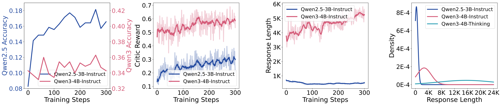
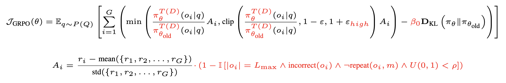
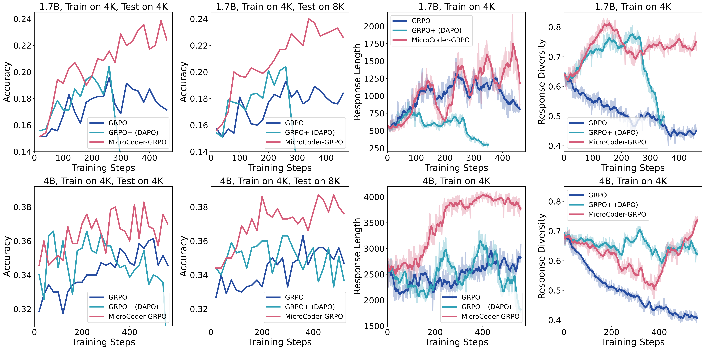
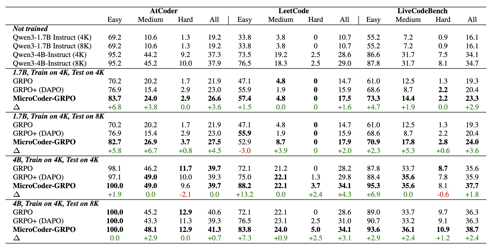

# MicroCoder: Breaking Training Bottlenecks for Modern Coding Models

<p align="center">
  <b>Content</b>
</p>

<p align="center">
  <a href="#news">🚀News</a> •
  <a href="#paper_list">📖Paper_List</a> •
  <a href="#motivation">✨Motivation</a>
</p>

<p align="center">
  <a href="#analysis">📈Analysis</a> •
  <a href="#algorithms">🖥️Algorithms</a> •
  <a href="#dataset">🗂️Dataset</a> •
  <a href="#code_evaluator">💯Code_Evaluator</a>
</p>

<p align="center">
  <a href="#citation">📌Citation</a> •
  <a href="#license">🔖License</a>
</p>

<p align="center">
  <b>Links</b>
</p>

<p align="center">
  <a href="">Algorithm Paper</a> •
  <a href="">Dataset Paper</a> •
  <a href="https://github.com/ZongqianLi/MicroCoder/blob/main/MicroCoder-Insights.md">Insights Blog</a>
</p>

<div id="news">&nbsp;</div>


## 🚀 News

- **[XXXX.XX.XX]** The paper was uploaded to Arxiv.

<div>&nbsp;</div>
<div>&nbsp;</div>
<div id="paper_list">&nbsp;</div>


## 📖 Paper List

This is the project page for MicroCoder and a brief summary for the papers below:

- **Breaking Training Bottlenecks: Effective Reinforcement Learning for Modern Coding Models**  
  Zongqian Li <sup>1, 2</sup>, Shaohan Huang <sup>1</sup>, Zewen Chi <sup>1</sup>, Yixuan Su <sup>2</sup>, Lexin Zhou <sup>3</sup>, Li Dong <sup>1</sup>, Nigel Collier <sup>2</sup>, Furu Wei <sup>1</sup>    
  Microsoft <sup>1</sup>, University of Cambridge <sup>2</sup>, Princeton University <sup>3</sup>    
  [Algorithm_Paper]()
- **MicroCoder-Dataset: A Latest and Challenging Dataset for Training Modern Coding Models**  
  Zongqian Li <sup>1, 2</sup>, Shaohan Huang <sup>1</sup>, Tengchao Lv <sup>1</sup>, Lei Cui <sup>1</sup>, Nigel Collier <sup>2</sup>, Furu Wei <sup>1</sup>    
  Microsoft <sup>1</sup>, University of Cambridge <sup>2</sup>  
  [Dataset_Paper]()
- **MicroCoder-Insights: Training Recipes for Modern Coding Models**  
  123  
  [Insight_Blog](https://github.com/ZongqianLi/MicroCoder/blob/main/MicroCoder-Insights.md)

<div>&nbsp;</div>
<div>&nbsp;</div>
<div id="motivation">&nbsp;</div>


## ✨ Motivation

- **Cross-generational training effectiveness**: Current training methods demonstrate substantial improvements on Qwen 2.5 models but minimal improvements on Qwen 3 models, revealing generation-specific training bottlenecks
- **Dataset difficulty gap**: Mainstream datasets pose greater difficulty for Qwen 2.5 while appearing relatively simple for Qwen 3 capabilities, indicating need for more challenging training corpora
- **Fundamental behavioral differences**: Output behavior patterns differ fundamentally between generations; Qwen 3 models exhibit pronounced upward trends in response length during training whereas Qwen 2.5 models show stable or decreasing lengths; across model series progression from Qwen 2.5 Instruct to Qwen 3 Instruct to Qwen 3 Thinking, standard outputs demonstrate increasing length and variance

<p align="left">
  
</p>

_Figure: Algorithm: GRPO+, Max Response Length: 8K, Test Dataset: LiveCodeBench v6, Train Batch Size: 64_

<div>&nbsp;</div>
<div>&nbsp;</div>
<div id="analysis">&nbsp;</div>


## 📈 Analysis: MicroCoder-Insights

[MicroCoder-Insights: Training Recipes for Modern Coding Models](https://github.com/ZongqianLi/MicroCoder/blob/main/MicroCoder-Insights.md)

Through comprehensive analysis across more than thirty controlled experiments, we reveal 34 key training insights across seven main aspects including code evaluator, temperature, training data, context length and extension, truncation mask strategies, batch size and on-policy, KL loss and clip ratio.

<p align="left">
  
</p>

<div>&nbsp;</div>
<div>&nbsp;</div>
<div id="algorithms">&nbsp;</div>


## 🖥️ Algorithms: MicroCoder-GRPO

[Breaking Training Bottlenecks: Effective Reinforcement Learning for Modern Coding Models]()

To address training bottlenecks, we propose MicroCoder-GRPO, an enhanced Group Relative Policy Optimization approach with three key innovations: 

- conditional truncation masking to enhance long output potential while maintaining training stability,
- diversity-determined temperature selection to maintain and encourage output diversity,
- and removal of KL loss with high clipping ratios to facilitate exploration.

The modifications of MicroCoder-GRPO compared to GRPO are shown as the red components in the equations:

<p align="left">
  
</p>

$\theta$: current policy parameters, $\theta_{\text{old}}$: reference policy parameters, $\pi_{\theta}$: policy with parameters $\theta$, $\pi_{\theta_{\text{old}}}$: old/reference policy, $T(D)$: training temperature determined by diversity, $D$: output diversity, $\beta_0$: KL loss weight (set to 0), $\varepsilon$: clipping trust region parameter, $\varepsilon_{\text{high}}$: high clipping value, $L_{\max}$: maximum response length, $\rho$: masking probability, $m$: repeat check parameter (128 tokens), $q$: query, $Q$: set of queries, $P(Q)$: probability distribution over queries, $G$: number of outputs/samples, $o_i$: output $i$, $r_i$: reward for output $i$, $A_i$: advantage score for output $i$, $U(0,1)$: uniform distribution over [0,1], $\mathbb{I}[\cdot]$: indicator function, $\mathbf{D}_{\text{KL}}$: KL divergence, $\text{incorrect}(o_i)$: indicates whether output $i$ is incorrect, $\neg\text{repeat}(o_i, m)$: checks for non-repetition sequences (final 128 tokens differ from preceding 128 tokens)

<p align="left">
  
</p>

_Figure: Temperature: 1.2, Train Dataset: MicroCoder-Dataset, Test Dataset: LiveCodeBench v6, Train Batch Size: 64_

<p align="left">
  
</p>

<div>&nbsp;</div>
<div>&nbsp;</div>
<div id="dataset">&nbsp;</div>


## 🗂️ Dataset: MicroCoder-Dataset

[MicroCoder-Dataset: A Latest and Challenging Dataset for Training Modern Coding Models]()


<div>&nbsp;</div>
<div>&nbsp;</div>
<div id="code_evaluator">&nbsp;</div>


## 💯 Code Evaluator: MicroCoder-Evaluator


<div>&nbsp;</div>
<div>&nbsp;</div>
<div id="citation">&nbsp;</div>


## 📌 Citation

```

```

```

```

<div>&nbsp;</div>
<div>&nbsp;</div>
<div id="license">&nbsp;</div>


## 🔖 License


<div>&nbsp;</div>
<div>&nbsp;</div>
<div id="">&nbsp;</div>


